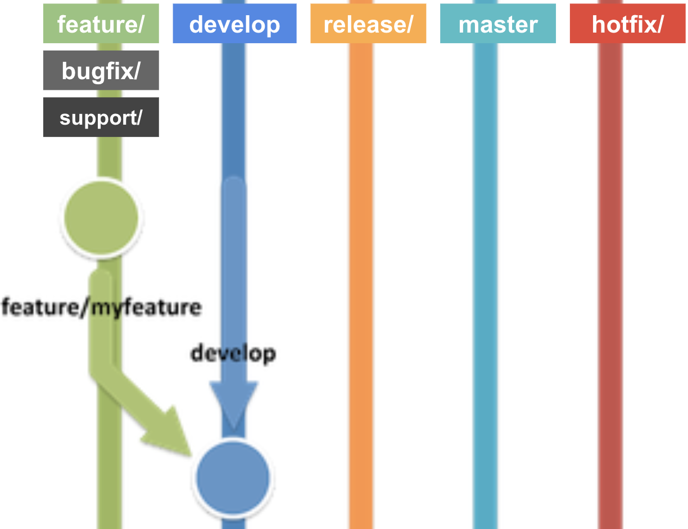
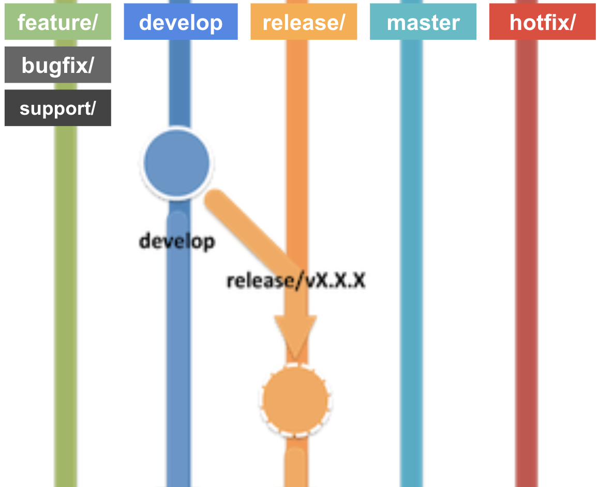
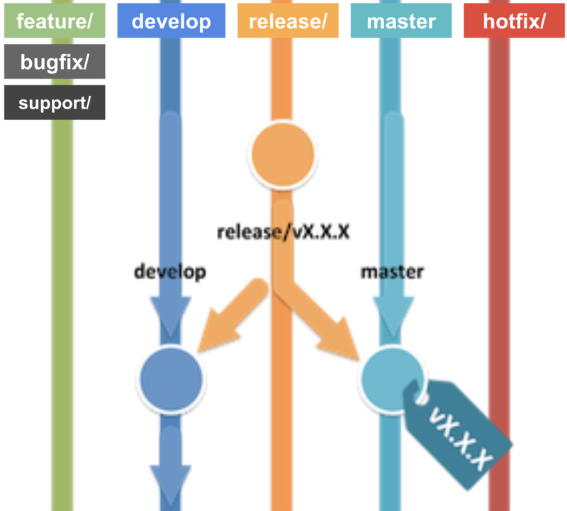
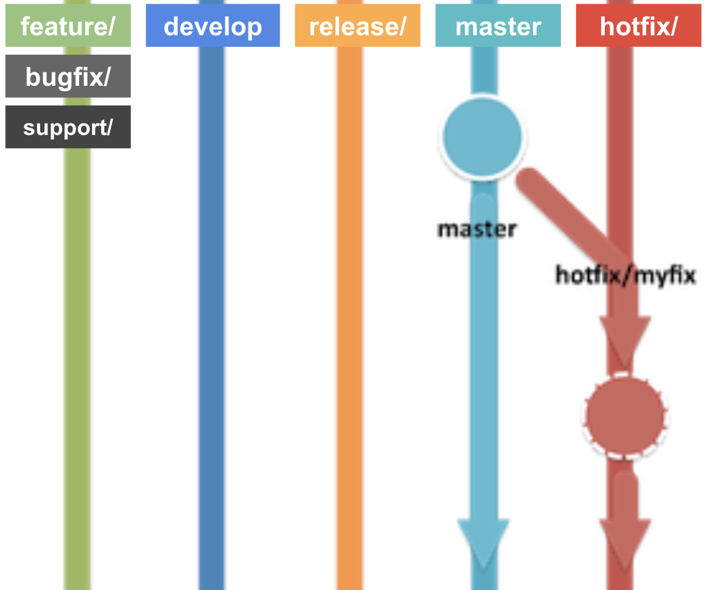
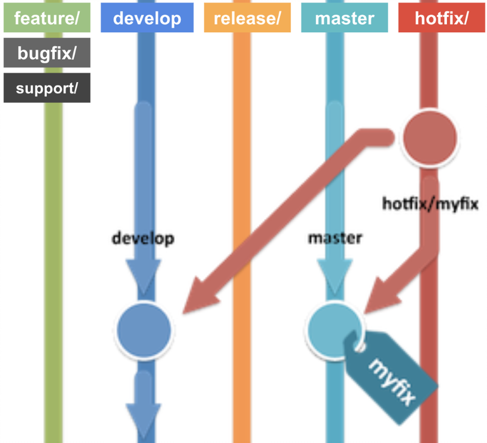
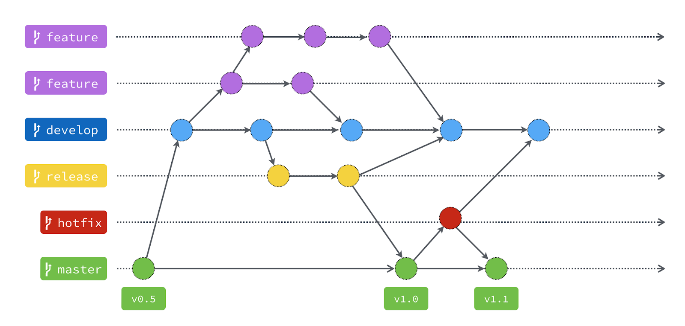

Develop Guides
==============

Good Practices
--------------
### TDD
**Test Driven Development**, es una práctica de desarrollo que pone énfasis en la generación de pruebas previas a los cambios realizados por el desarrollador. Ésta relevancia de las pruebas conlleva en particular dos prácticas:

- **Escribir pruebas primero:** Establecer un set de pruebas (generalmente unitarias) previo a la generación de nuevo código, con el fin de testearlo y elevar la calidad del código generado. ELLa justificación de ésto es el evitar caer en malas prácticas que nos lleven a perder la noción de lo que el código hace. En agilidad este concepto se cruza con la definición de pruebas en razón de los criterios de aceptación de una historia de usuario, el cual se simplifica y mecaniza en pruebas unitarias.

- **Refactorizar el código generado:** Se refiere a la limpieza o simplificación del código generado en razón de las definiciones de las pruebas generadas. En primera instancia esto permite establecer con claridad el funcionamiento y alcance de lo que se pretende desarrollar y asimismo, una vez se genere un set de puerbas consistentes permitirá evitar problemas de código duplicado, agrupación de funciones o el uso de herencia y polimorfismos.


### Security first
Comprende la necesidad de desarrollar teniendo en cuenta ciertos niveles mínimos de seguridad desde el inicio de un proyecto. En particular algunas prácticas que comprende son:

#### No secrets
No almacenar configuraciones, claves, passwords o secretos tanto en los repositorios del proyecto, como tampoco en las instancias o servidores que contienen el proyecto, en cualquiera de los ambientes que existan.

#### Análisis de vulnerabilidades
Se refiere a análisis y auditorias de integridad y seguridad que deben integrarse al flujo de desarrollo e implementaciones hacia producción.

##### SAST
**Static Application Security Testing.** Se compone un pruebas del tipo *"white box"* que permite a al desarrollador encontrar vulnerabilidades de seguridad a nivel de código durante las primeras fases de desarrollo. Este tipo de pruebas permite revisar la estructura interna de una aplicación, más que su funcionalidad. Por lo anterior, los análisis de tipo SAST se ejecutan antes de la compilación y la mayoría soportan y analizan los lenguajes de progrmación más populares.

##### DAST
**Dynamic Application Security Testing.** Son pruebas del tipo *"black box"*, y permiten analizar vulnerabilidades durante la ejecución de una aplicación. Ejemplos típicos de este tipo de pruebas son las inyecciones de SQL o la ejecución de scripts entre sitios. por efecto, permite detectar vulnerabilidades de infraestructura y seguridad de plataformas. La idea de base de este tipo de pruebas es provocar fallas a través de actividad maliciosa.

##### IAST
**Interactive Application Security Testing.** Este tiopo de pruebas toma elementos de SAST y DAST, a través del uso de "agentes" integrado en la aplicación (o el framework de la misma) permitiendo analizar en tiempo real diversos niveles de vulnerabilidades (código, scripts, configuraciones, flujos de datos, request y response HTTP, etc). El beneficio de este tipo de pruebas es su alta tasa de aciertos y registro de vulnerabilidades.

##### RASP
**Runtime Application Security Protection.** Comprende un grupo de pruebas o inspecciones integradas en una aplicación. Su rol principal es analizar el comportamiento del software y proteger la aplicación ante vulnerabilidades y brechas de seguridad, a nivel de red y ejecución. La protección entregada es continua.

#### OWASP
Open Web Application Security Project. Es un proyecto que busca establecer y combatir las causas por las cuales un software es inseguro.

**OWASP Guide (v3):** https://owasp.org/www-project-web-security-testing-guide/assets/archive/OWASP_Testing_Guide_v3.pdf
**OWASP Guide (v4):** https://www.owasp.org/images/1/19/OTGv4.pdf

More info: 
https://owasp.org/
https://cheatsheetseries.owasp.org/

<!-- 
Dev Approaches
--------------
### Seguridad y Vulnerability-less

### Docker as Dev Environment

### Micro-frontends

### Backend for frontends -->
 
Code control
------------
### Concepto
Una metodología que proporciona un mejor control y administración del código de un proyecto de software, es aquella que adopta los conceptos de Gitflow. Con esta implementación es posible ordenar las tareas de los equipo de desarrollo, asi como las historias asociadas en un proyecto ágil.

### Alcance
Permite gestionar el código relacionado a las tareas de los equipos de desarrollo y tod@s aquellos que trabajan sobre el proyecto, ya sea en teams o de forma individual.

### Uso de Ramas
Siguiendo las definiciones de Git, la historia de cambios puede ser separado en ramas de trabajo. Según Gitflow, las ramas a utilizar son:

- **Principales:** Aquellas que son permanentes en la historia del proyecto.
    - **develop:** Rama con historia principal de desarrollo.
    - **master:** Rama con historia de producción. *Bloqueada para ser modificada por desarrolladores.*

- **Auxiliares:** Aquellas de carácter temporal utilizadas para ordenar y separar los cambios previos a una liberación a las historias principales de la cual se origina. 
    - **feature/:** Rama para el desarrollo de cambios y nuevas funcionalidades. Auxiliar, temporal.
    - **bugfix/:** Rama para la solución de issues menores en desarrollo.
    - **support/:** Rama para la solución de issues técnicos en desarrollo
    - **release/:** Rama para la entrega de versiones a producción. Auxiliar, temporal.
    - **hotfix/:** Rama para la solución de issues críticos pero no funcionales  en producción. Auxiliar, temporal.
​
 

- **Tags:** Hitos de control. Definen un punto en la historia del proyecto.


### Tag Formulae
#### SemVer (semantic versioning, https://semver.org/lang/es/)
+ **MAJOR:** version when you make incompatible API changes,
+ **MINOR:** version when you add functionality in a backwards compatible manner, and
+ **PATCH:** version when you make backwards compatible bug fixes.

Additional labels for pre-release and build metadata are available as extensions to the *MAJOR.MINOR.PATCH* format.


### Roles de gestión Git
- **Dueño:**
    - Superadministrador de TODOS los grupos.
    - Crea y configura sub-grupos, ramas e integraciones.

- **Mantenedor:**
    - Administrador de sub-grupos
    - Puede:
        - Crear sub-grupos.
        - Crear Proyectos.
        - Habilitar integraciones, tokens y group-runners.
        - Trabajar en ramas protegidas (commit y merge request)

- **Desarrollador:**
    - Puede:
        - Crear Proyectos
        - Hacer clone, pull and push
        - Crear ramas NO protegidas.
        - Crear y aprobar commit y merge request a ramas NO protegidas.

- **Visor (Reporter):**
    - Puede:
        - Ver código, ramas, tags y merge request.
        - Clonar proyecto pero NO editar

### Proceso
#### Iniciar proyecto/repositorio
- **De manera local.**
    - Posicionarse en la carpeta que contendrá el proyecto: git init
    - Crear rama de desarrollo
        - Si tiene git flow instalado*:
            ```git flow init```
        - Si NO tiene git flow instalado:
            ```git checkout -b develop```
    - Crear repositorio en servidor
    - Agregar url de repositorio en servidor
        ```git remote add origin git@urlrepositorio.git```
    - Subir primer código (o agregar README.md)
        ```git add .```
        ```git commit -m "primer commit"```
        ```git push -u origin master```

- **En el servidor de git:**
    - Crear repositorio
    - Crear rama develop
    - Activar plugin de ChatOps / gitbot correspondiente.
    - Clonar repositorio en local
        ```git clone URL_REPOSITORIO```
 
#### Trabajar con feature o historia de cambio
- Clonar repositorio:
    ```git clone```
- Posicionarse en develop
    ```git checkout develop```
- Crear rama de cambio
    ```git checkout -b feature/myfeature```
- Una vez hecho algunos cambios en el código hacer punto de control (commit de estos cambios)
    ```git add .```
    ```git commit -m “descripción commit”```
- Luego de varios commit de control y para precaver pérdida de trabajo es necesario subir la nueva rama de trabajo y los cambios realizados *(cabe recordar que en git los commit son locales mientras no se haga "push" al repositorio remoto)*.
    - Si la rama de trabajo no existe se debe enviar al repositorio remoto
        ```git push --set-upstream origin feature/myfeature```
    - Si la rama ya existe en lo sucesivo basta con enviar el código
        ```git push```


- Una vez el cambio o la historia puede ser cerrado se debe integrar en la rama de desarrollo.
    - Esto requiere previamente:
        - que la rama feature contenga cambios que otras historias han integrado en "develop"
        - que la rama feature esté sin cambios "por commitear"
        - que la rama feature integre los cambios de la rama develop que hayan sido integrados por otro feature.
        - que la rama feature integre cambios que otr@(s) desarrollador(es) haya subido a la rama remota.
            ```git pull origin remote```
            ```git checkout develop```
            ```git pull origin remote```
            ```git checkout feature/myfeature```
            ```git merge develop```
            ```git checkout develop```
            ```git merge feature/myfeature```
- Una vez integrado la historia de cambios en desarrollo se requiere eliminar rama en el repositorio local y remoto
    ```git branch -d feature/myfeature```
    ```git push origin :feature/myfeature```



#### Liberar releases
- Posicionarse en develop
    ```git checkout develop```
- Crear rama de cambio
    ```git checkout -b release/vX.X.X```
- Una vez hecho algunos cambios en el código hacer punto de control (commit de estos cambios)
    ```git add .```
    ```git commit -m “descripción commit”```
- Luego de varios commit de control y para precaver pérdida de trabajo es necesario subir la nueva rama de trabajo y los cambios realizados *(cabe recordar que en git los commit son locales mientras no se haga "push" al repositorio remoto)*.
    - Si la rama de trabajo no existe se debe enviar al repositorio remoto
        ```git push --set-upstream origin release/vX.X.X```
    - Si la rama ya existe en lo sucesivo basta con enviar el código
        ```git push (en las publicaciones sucesivas)``



- Una vez el cambio o la historia puede ser cerrado se debe integrar en la rama de develop.
    ```git checkout develop```
    ```git merge release/vX.X.X```
-  Y a su vez se debe integrar en la rama de master.
    ```git pull origin remote```
    ```git checkout master```
    ```git merge release/vX.X.X```
- Además debe crearse el tag correspondiente al release.
    ```git tag -a vX.X.X -m “new version vX.X.X"```
    ```git tag vX.X.X```
    ```git tag -a vX.X.X 1a2b3c```
    ```git push origin vX.X.X```
    ```git push origin --tag```
- Finalmente se debe eliminar la rama release correspondiente.
    ```git branch -d release/vX.X.X```
    ```git push origin :release/vX.X.X```



#### Trabajar con Hotfixes
- Posicionarse en master
    ```git checkout master```
- Crear rama de cambio
    ```git checkout -b hotfix/myfix```
- Una vez hecho algunos cambios en el código hacer punto de control (commit de estos cambios)
    ```git add .```
    ```git commit -m “descripción commit”```
- Luego de varios commit de control y para precaver pérdida de trabajo es necesario subir la nueva rama de trabajo y los cambios realizados *(cabe recordar que en git los commit son locales mientras no se haga "push" al repositorio remoto)*.
    - Si la rama de trabajo no existe se debe enviar al repositorio remoto
        ```git push --set-upstream origin hotfix/myfix```
    - Si la rama ya existe en lo sucesivo basta con enviar el código
        ```git push```



- Una vez el cambio o la historia puede ser cerrado se debe integrar en la rama de develop.
```git checkout develop```
```git merge hotfix/myfix```
-  Y a su vez se debe integrar en la rama de master.
```git checkout master```
```git merge hotfix/myfix```
- Además debe crearse el tag correspondiente al hotfix.
```git tag -a vX.X.X -m “new version vX.X.X-myfix"```
```git push origin vX.X.X-myfix```
- Finalmente se debe eliminar la rama release correspondiente.
```git branch -d hotfix/myfix```
```git push origin :hotfix/myfix```



### Flujo



Security Test
-------------
### Clair: 
Herramientas SAST que analiza contenedores en busca de vulnerabilidades.

### OWASP Depedency-check: 
analiza vulnerabilidades en los componentes de aplicaciones basadas en java, .NET, php, ruby y python.

### Detect-secrets: 
detecta y previene el almacenamiento de contraseñas y secretos en el código fuente.

### Sonarqube: 
Analiza el código fuente en busca de vulnerabilidades, malas prácticas y errores de codificación. Permite general estadísticas de coverage, calidad y seguridad del código.

### Veracode: 
Es una aplicación/servicio tanto SAST como DAST, que analiza aplicaciones en busca de vulnerabilidades y otros riesgos de seguridad.

### Gitlab AutoDevOps: 
herramienta integrada a gitlab que permite realizar validaciones de seguridad, como check de dependencias, almacenamiento de secretos y análisis de vulnerabilidades.

### NPM Audit: 
Plugin de NPM que permite analizar estado de las dependencias/módulos de una aplicación basada en NodeJS y entregar un reporte del estado y tipo de vulnerabilidades.

### OWASP Depedency-check Maven Plugin: 
plugin POM que añade análisis de dependencias durante la compilación de una aplicación basada en Maven/Springboot (existe un símil como módulo de NodeJS).

### Docker Bench for Security